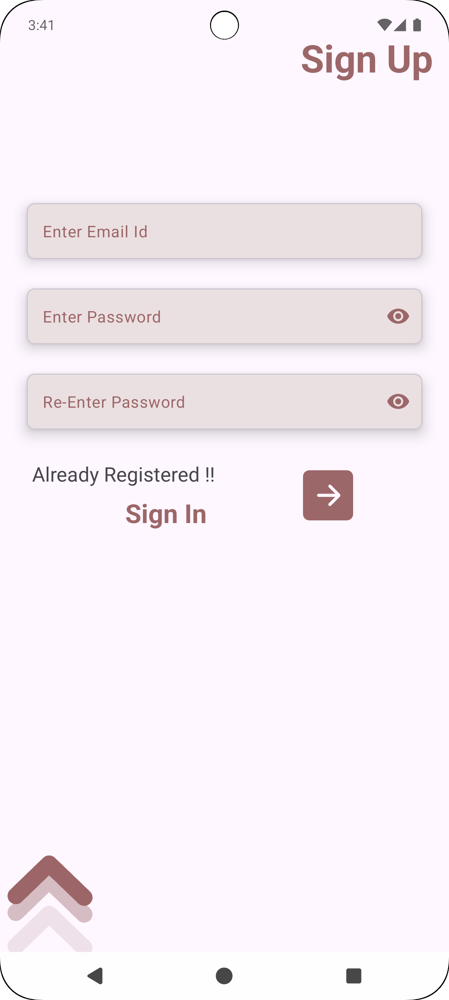
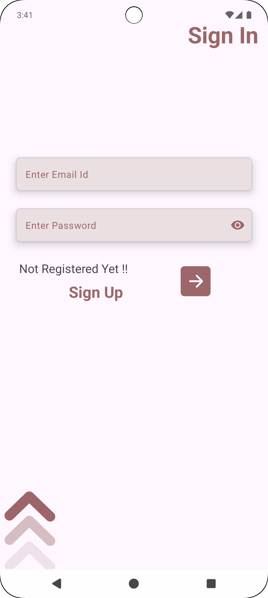
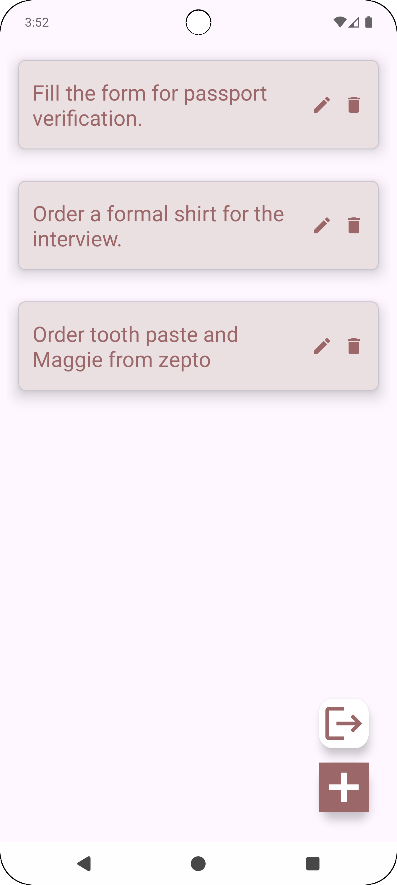
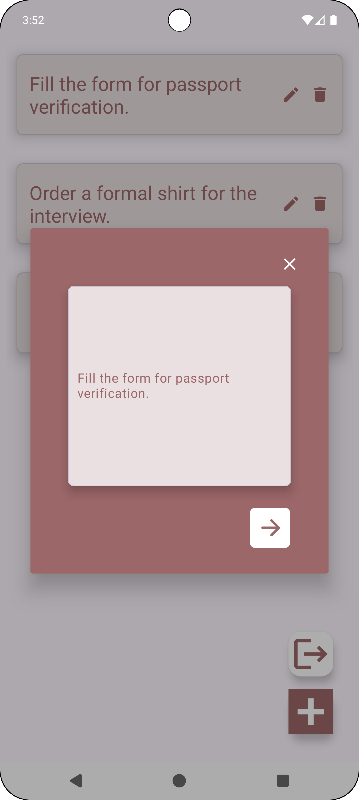

# ToDo Flow - Task Management App | [Website](https://ritikraaj77.github.io/ToDoFlow/)

## Introduction

ToDo Flow is a simple yet powerful task management application designed to help users organize and track their daily tasks efficiently. With an intuitive UI and real-time data synchronization, users can easily create, update, and manage their to-do lists.

## Key Features
- Add, edit, and delete tasks seamlessly
- Mark tasks as completed for better productivity tracking
- Categorize tasks for better organization
- Real-time data sync using Firebase Firestore
- Secure user authentication with Firebase Authentication
- Intuitive UI/UX following Material Design principles

## Media Gallery

<!-- 2x3 Grid with Screenshots -->
<table style="width:100%;">
  <tr>
    <td style="padding: 10px;"></td>
    <td style="padding: 10px;"></td>
    <td style="padding: 10px;"></td>
  </tr>
  <tr>
    <td style="padding: 10px;"></td>
    <td style="padding: 10px;"></td>
    <td style="padding: 10px;"></td>
  </tr>
</table>

## Technical Details
- **Architecture**: MVVM (Model-View-ViewModel) for maintainable and scalable code
- **Authentication**: Firebase Authentication for secure login/sign-out
- **Database**: Firebase Firestore for real-time task management
- **RecyclerView**: Efficiently displays tasks with smooth scrolling
- **Jetpack Compose**: Modern UI framework for a smooth user experience

## Tools & Libraries
- **Languages**: Kotlin
- **Database**: Firebase Firestore
- **Authentication**: Firebase Authentication
- **UI/UX**: Material Design, Android Jetpack Components, Jetpack Compose
- **Navigation**: Jetpack Navigation Component

## Outcomes
- Successfully developed a scalable to-do list application using modern mobile frameworks
- Improved expertise in Firebase Firestore for real-time data handling
- Enhanced understanding of MVVM architecture and Jetpack Compose UI development

## Key Challenges & Solutions
- **Challenge**: Implementing real-time task synchronization
  - **Solution**: Used Firestore listeners to update UI instantly when tasks are added or modified
- **Challenge**: Ensuring a seamless user authentication experience
  - **Solution**: Integrated Firebase Authentication with Google Sign-In for a smooth login process

## Future Enhancements
- Adding task reminders and notifications
- Implementing collaborative task sharing between users
- Introducing offline support for task management

---
Developed with ❤️ by [Ritik Raj](https://github.com/RitikRaaj77)
